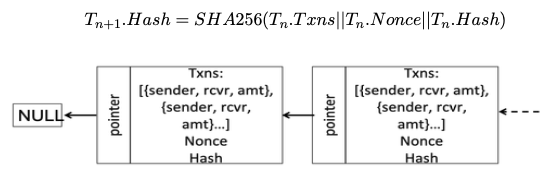

# Blockchain-version2
This is second version of the simplified Blockchain using Paxos as a consensus protocol. The first version is a mutual exclusion approach. Version 2 will be a peer to peer exchange application on top of private blockchain to create a trusted but fault-tolerant decentalized system such that transactionsbetween 2 clients can be executed withou any middle-man.
---
# Nodes

---
# Hashing and Nonce 

---
# Threads and Main Components

